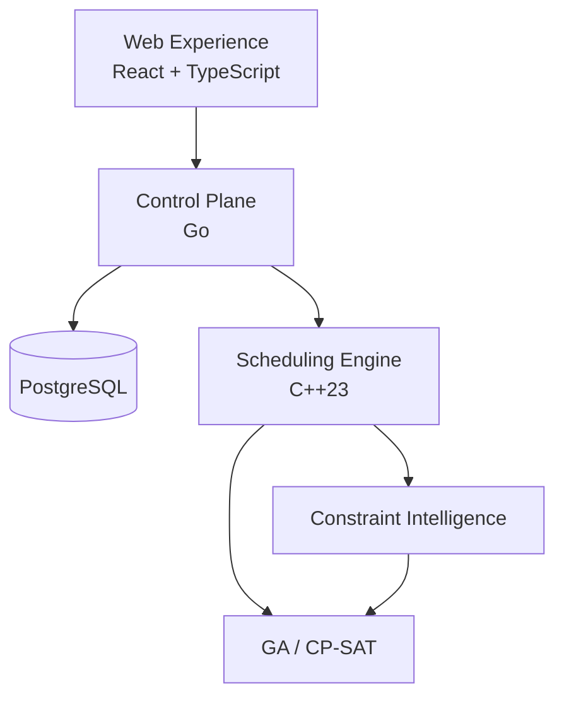

# Constraint-Based Scheduling & Optimization Platform

<p align="center"><strong>A general-purpose platform for visually modeling, solving, explaining, and evolving constrained scheduling problems.</strong></p>

<p align="center">
  <a href="https://github.com/furkanalk/scheduling-platform/actions/workflows/build.yml"></a>
  
  
  
  
  
  
</p>

## Overview

The platform is designed for scheduling problems where activities, resources, time, business rules, preferences, and operational objectives must be considered together.

Instead of hard-coding every scheduling domain, the product is built around a generic scheduling model. Users should eventually be able to define resource types, activity types, attributes, constraints, and optimization objectives through a high-level UI without writing solver code.

Academic scheduling is the first prebuilt package. Aviation is the second planned reference package. Custom user-defined models are a first-class capability.

## Product architecture



The durable product center is:

```text
Scheduling Model
+ Rule IR
+ Validation
+ Solver Translation
+ Constraint Intelligence
+ Replanning / Scenarios
```

## Rule authoring

The primary rule-authoring experience is guided and visual.

```text
WHEN
    Activity.category = "Lab"

REQUIRE
    Assigned Resource.equipment contains "Computer"

SEVERITY
    Hard
```

The UI produces a typed, validated rule representation rather than arbitrary executable code. AI may assist by proposing structured rules, but users must review and confirm them before they become active.

## Constraint Intelligence

The platform aims to go beyond returning a feasible schedule or an infeasible status. It should explain blocking rules, recommend the smallest useful changes, estimate operational impact, and compare recovery scenarios.

## Technology direction

| Layer | Technology |
|---|---|
| Scheduling/modeling engine | C++23 |
| Constraint Intelligence | C++23 |
| Solver backends | C++23 + OR-Tools CP-SAT |
| Control plane / API | Go |
| Main UI | TypeScript + React |
| Persistence | PostgreSQL 18.x |
| Dynamic model attributes | PostgreSQL `jsonb` where appropriate |
| Local deployment | Docker Compose |
| Production / on-prem | OCI containers, Kubernetes later |
| Rust | Optional future components only |

Rust is intentionally not part of the core stack today. It may be introduced later for a Tauri desktop shell, secure plugin/extension runtime, CLI/agent, WASM sandbox, or another component where it has a concrete advantage.

## Building the current C++ foundation

```powershell
cmake --preset windows-x64-debug
cmake --build --preset windows-x64-debug
ctest --preset windows-x64-debug
```

The target runtime architecture will expand toward Linux-based OCI solver containers while preserving deterministic C++ engine behavior.

## Documentation

- [`docs/PRODUCT_VISION.md`](docs/PRODUCT_VISION.md)
- [`docs/TECHNICAL_ARCHITECTURE.md`](docs/TECHNICAL_ARCHITECTURE.md)
- [`docs/RULE_MODELING.md`](docs/RULE_MODELING.md)
- [`docs/CONSTRAINT_INTELLIGENCE.md`](docs/CONSTRAINT_INTELLIGENCE.md)
- [`docs/PRODUCT_DIFFERENTIATION.md`](docs/PRODUCT_DIFFERENTIATION.md)
- [`docs/ROADMAP.md`](docs/ROADMAP.md)
- [`docs/LICENSING.md`](docs/LICENSING.md)

## License

This repository is proprietary source-available software. No open-source license is granted. See [`LICENSE`](LICENSE).
